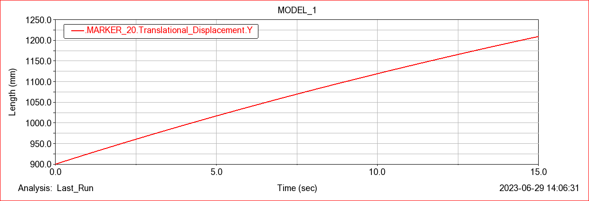

# Mechanical Jack Mechanism Simulation (ADAMS Project)  

📌 Project Overview  
This project investigates the design and simulation of a mechanical jack mechanism using ADAMS multibody dynamics software.  
The study compares different types of jacks (mechanical, hydraulic, pneumatic) and focuses on modeling and analyzing a mechanical screw jack.  

The project includes:  
1. Background study on jack mechanisms.  
2. CAD modeling of the mechanical jack in ADAMS.  
3. Simulation of forces, displacements, and torque.  
4. Analysis of results including force components and torque about key points.  

---

## 🎯 Objectives  
- Study different jack mechanisms (mechanical, hydraulic, pneumatic).  
- Model a mechanical screw jack system in ADAMS.  
- Apply appropriate joints and constraints to simulate realistic motion.  
- Evaluate displacement, forces along axes, and torque around the shaft.  
- Demonstrate how ADAMS simulation can replicate physical mechanical systems.  

---

## 🛠 Tools & Software  
- ADAMS – Multibody dynamics simulation of the jack system.  
- CAD Pre-Modeling – Simple link and screw geometry for import into ADAMS.  

---

## 📐 Methodology  

### 1. System Modeling  
- Constructed triangular links and connecting members.  
- Applied revolute joints at connection points.  
- Modeled a screw joint with specified pitch to simulate vertical motion.  
- Added a handle (cylindrical part) to represent the manual operating mechanism.  

### 2. Simulation Setup  
- Constraints applied to fix the lower triangular links.  
- Rotational input applied to the central shaft.  
- Forces applied at joints to simulate load conditions.  

### 3. Simulation Execution  
- Ran ADAMS simulation with zero acceleration assumption.  
- Extracted plots of displacement, force components, and torque.  

---

## 📊 Results  
- The jack produced purely vertical displacement under load.  
- Force diagrams along X, Y, Z axes were extracted.  
- Torque about the central shaft (point A) was calculated and plotted.  
- Results confirmed proper jack functionality and realistic motion behavior.  

### Simulation Outputs  

---

## 📂 Repository Structure

├── Model file/ # ADAMS model and simulation files\

├── Animation/ # Motion of mechanism

├── plots/ # Simulation plots (displacement, forces, torque)

└── README.md # This file

---

## 🔬 Applications  
- Educational demonstration of mechanical jack systems.  
- Simulation of lifting devices in mechanical design.  
- Validation of multibody dynamics with ADAMS.  
- Engineering studies in automotive and machinery applications.  

---

## 👨‍🎓 Authors  
- Mahdi Khademi  
- Negar Naghavian
- Supervised by: Dr. Sasan Asiyayi  

Course: Machine Dynamics  

---

## 📖 References  
- Course lecture notes on multibody dynamics.  
- Standard references on mechanical jack mechanisms.  
- ADAMS documentation for modeling and simulation.
